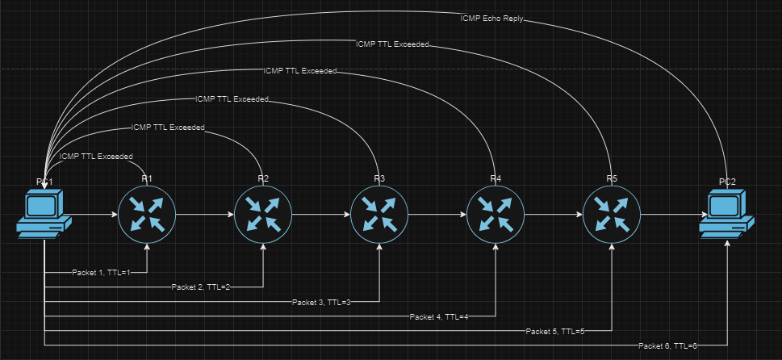
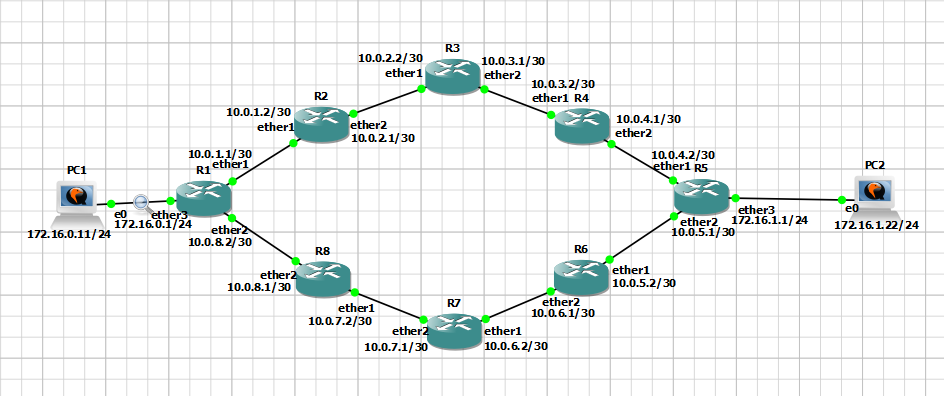
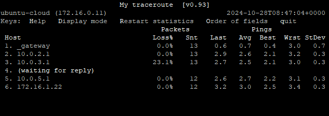

Internet itu seperti jalan raya yang menghubungkan satu tempat ke tempat lainnya. Kita bisa menggunakan Google Map untuk memantau jalur ke suatu tempat, dan menganalisa di titik-titik mana saja terjadi kemacetan dan lain sebagainya. Sedangkan untuk menganalisa jalur internet, maka kita menggunakan traceroute. Traceroute digunakan untuk memetakan setiap Router yang dilewati packet untuk sampai ke perangkat tujuan dengan memanfaatkan TTL (Time to Live). Sehingga kita bisa melakukan troubleshooting dengan menganalisa hasil pemetaan tersebut.

>- Ada istilah _traceroute, mtr, tracert_ ketika kita membahas Traceroute. Traceroute dan mtr adalah command yang digunakan pada Linux. Sedangkan tracert adalah command yang digunakan pada Windows. Jadi ketika kita membicarakan "traceroute", itu bisa mengacu pada 3 istilah tersebut.

## Apa Itu TTL (Time to Live)?

Di dalam IP Header terdapat field TTL yang fungsinya adalah mencegah packet dari berkelana tanpa henti dari Router ke Router tanpa pernah mencapai tujuannya, atau yang disebut Looping. Nilai minimum TTL adalah 1, dan maksimum 255. Jika packet memiliki TTL 32, maka packet tersebut bisa melompat dari Router ke Router sebanyak 32 kali untuk mencapai tujuannya. Setiap Router yang dilewati akan mengurangi 1 nilai pada TTL. Jika setelah 32 kali packet tersebut tidak sampai ke tujuan alias TTL mencapai 0, maka packet tersebut akan di drop. Lalu Router yang men-drop packet tersebut akan mengirimkan pesan ICMP "TTL Exceeded" ke pengirim.

## Cara Kerja Traceroute

Traceroute memetakan rute jaringan dengan cara mengirim packet yang dimulai dengan TTL 1, dan packet selanjutnya TTL n+1. Ketika packet diterima oleh Router pertama, TTL berkurang 1 sehingga menjadi 0. Router mengirim ICMP TTL Exceeded ke Pengirim yang memuat informasi IP Router dan jarak tempuh packet dari Pengirim-Router-Pengirim (RTT). Selanjutnya Traceroute kembali mengirim packet dengan TTL 2. Router pertama menerima packet tersebut dan mengurangi TTL 1. Router kedua menerima packet tersebut dan juga mengurangi TTL 1 sehingga menjadi 0. Router kedua mengirim ICMP TTL Exceeded ke Pengirim. Begitu seterusnya sampai packet tiba di tujuan. Dengan cara ini traceroute bisa memetakan setiap Router yang dilewati packet hingga sampai di tujuan.

## Simulasi Traceroute Menggunakan GNS3

Topologi ini didesain agar jalur trafik antara PC1 dan PC2 asimetris. Jadi trafik dari PC1 ke PC2 akan berbeda dari PC2 ke PC1. Tujuannya adalah untuk menjelaskan bahwa hasil traceroute hanya menunjukkan jalur dari pengirim ke penerima, bukan sebaliknya. Langsung saja kita gunakan command mtr dari PC1 ke PC2.

[ PC1 ke PC2")](http-pc1-pc2.png)

[ PC1 ke PC2")](http-wireshark.png)

Pada Gambar 3, trafik dari PC1 melewati IP Router R1, R2, R3, R4 dan R5 untuk mencapai PC2. Sekarang perhatikan Gambar 4. Menggunakan wireshark, kita bisa melihat urutan packet ICMP Echo Request yang dikirim oleh PC1 ke PC2 yang dimulai dengan packet yang TTL-nya bernilai 1. Packet pertama ini sampai ke R1 sehingga TTL nya berkurang 1 dan menjadi 0. R1 men-drop packet dan kemudian mengirim ICMP TTL Exceeded ke PC1. PC1 kemudian kembali mengirim packet ICMP Echo Request dengan TTL=2. Packet tersebut diterima oleh R1 yang mengurangi 1 TTL. Sekarang TTL pada packet tersebut tersisa 1. Selanjutnya packet diterima oleh R2 yang juga mengurangi 1 TTL. TTL packet menjadi 0 dan R2 kemudian men-drop packet dan mengirim ICMP TTL Exceeded ke PC1. Begitulah seterusnya sampai packet ICMP Echo Request diterima oleh PC2 yang kemudian akan membalas dengan ICMP Echo Reply. Dengan cara ini, PC1 menerima informasi Router mana saja yang dilewati oleh packet-nya untuk mencapai PC2.

## Miskonsepsi Dalam Menganalisa Hasil Traceroute

### 1. Beranggapan bahwa packet yang dikirim dan yang diterima melewati jalur yang sama (Simetris).

Ketika kita menggunakan traceroute, kita hanya bisa melihat jalur dari jaringan kita ke jaringan target. Kita tidak dapat mengetahui jalur dari jaringan target ke jaringan kita dari hasil traceroute tersebut.

[ PC2 ke PC1")](http-pc2-pc1.png)

Pada Gambar 5 MTR dijalankan dari PC2 dengan target PC1. Hasilnya trafik dari PC2 melewati IP R5, R6, R7, R8, dan R1 sebelum mencapai PC1. Padahal ketika dijalankan dari PC1 ke PC2,  traceroute menunjukkan hasil jalur yang berbeda. Jalur kembali dari setiap Router yang dilewati oleh packet bergantung pada routing policy masing-masing Router. Sebagai contoh, Gambar 3 sebelumnya. Ketika PC1 mengirimkan packet ICMP Echo Request ke PC2 dengan TTL 2, packet tersebut melewati R1 dan kemudian di-drop oleh R2, yang kemudian mengirim packet ICMP TTL Exceeded ke PC1. Packet ICMP TTL Exceeded yang dikirim oleh R2 ke PC1 melewati jalur yang mana? Apakah langsung ke R1 lalu ke PC1? Jawabannya adalah tidak. R2 mengirim packet tersebut lewat R3, R4, R5, seterusnya sampai R8, ke R1, baru ke PC1. Karena beginilah routing policy R2 yang didesain pada topologi ini. Sekarang bayangkan topologi Internet yang jauh lebih kompleks.

Kesimpulannya, kita tidak bisa mengetahui jalur dari target ke pengirim dari hasil traceroute yang dilakukan dari pengirim ke target.

### 2. Terfokus pada packet loss, ping tinggi, atau RTO pada salah satu Router atau lebih sebelum mencapai tujuan.

Pada Gambar 6 ada packet loss sebesar 23.1% pada IP 10.0.3.1 (R3), dan RTO di Router selanjutnya. Lalu apakah ada masalah dengan hasil traceroute ini? Jawabannya adalah tidak. Packet loss atau RTO yang terjadi di tengah jalan tidak mengindikasikan apapun mengenai koneksi antara pengirim dan penerima. Seperti yang sudah dijelaskan di atas, jalur balik dari masing-masing Router ke pengirim bergantung pada routing policy masing-masing Router tersebut. Packet loss yang terjadi pada R3 menunjukkan ada masalah antara pengirim (PC1) dan Router tersebut, bukan masalah antara PC1 dan PC2. Karena antara PC1 dan PC2, peran R3 hanyalah meneruskan packet. Selama ping kecil dan packet loss pada tujuan adalah 0%, maka dapat disimpulkan bahwa koneksi client ke tujuan adalah normal. Sedangkan RTO yang terjadi pada Router ke 4 menunjukkan bahwa ada kemungkinan firewall yang memblokir ICMP antara Router tersebut dengan PC1. Akan tetapi tidak mempengaruhi koneksi antara PC1 dan PC2.

## Penutup

Jaringan internet sangatlah kompleks dan seringkali asimetris. Jadi untuk menganalisa jaringan antara 1 titik dengan titik lainnya seperti client-server, maka hasil traceroute dibutuhkan dari client ke server, dan dari server ke client.

Sebagai tambahan, ada 2 protocol yang dapat digunakan untuk melakukan traceroute, yaitu ICMP dan UDP. Cara kerja keduanya sama, akan tetapi yang paling umum digunakan adalah ICMP. Karena banyak Router yang memblokir packet UDP untuk alasan keamanan.