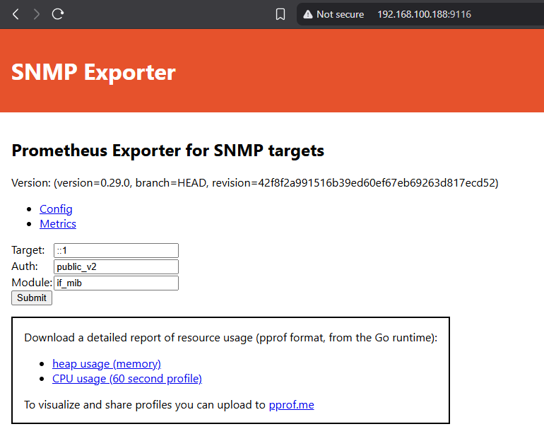
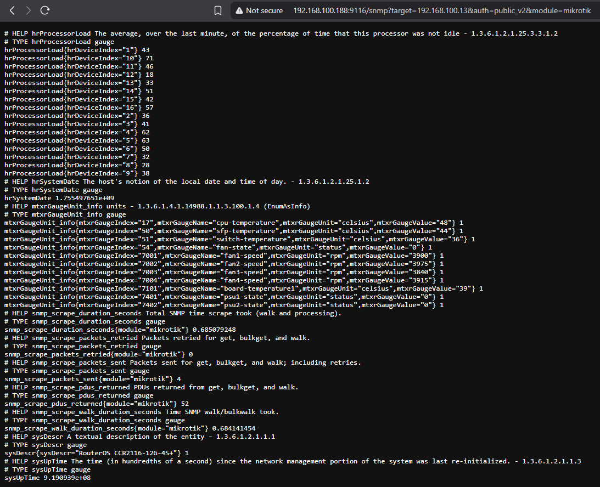

Artikel ini membahas tentang cara menginstall [SNMP Exporter](https://github.com/prometheus/snmp_exporter). Software ini digunakan untuk menarik data SNMP dan menerjemahkannya ke format yang dapat dibaca oleh Prometheus. Karena by-default Prometheus tidak dapat membaca data SNMP secara langsung.

## Pre-requisites

>- **Pemahaman dasar** dalam menggunakan Linux  
>- **Pemahaman dasar** mengenai *MIB* (Management Information Base) dan *SNMP* (Simple Network Management Protocol)
>- **Mengetahui** fungsi **Grafana** dan **Prometheus**  
>- Tutorial ini dan lanjutannya tentang **Prometheus** dan **Grafana** akan menggunakan server:  
  >-- Ubuntu `24.04.3 LTS (Minimized Version)`
>- Pastikan waktu pada server sudah akurat dan *System clock synchronized: yes*.  
  >-- Cek menggunakan command:  
    ```bash
    timedatectl
    ```
>- Tutorial ini dibuat dengan asumsi **SNMP pada Router/Switch dapat diakses dari server**.  
  >-- Cek menggunakan command:  
    ```bash
    snmpwalk -v2c -c community_name ip_target
    ```

## Instalasi SNMP Exporter
```bash

# Download SNMP Exporter.
# Versi terbaru dapat dilihat di https://github.com/prometheus/snmp_exporter/releases
grafana@grafana-wahayu:~$ cd /tmp
grafana@grafana-wahayu:/tmp$ wget https://github.com/prometheus/snmp_exporter/releases/download/v0.29.0/snmp_exporter-0.29.0.linux-amd64.tar.gz

# Ekstrak dan pindahkan file snmp_exporter ke /usr/local/bin
grafana@grafana-wahayu:/tmp$ tar -xvf snmp_exporter-0.29.0.linux-amd64.tar.gz
grafana@grafana-wahayu:/tmp$ cd snmp_exporter-0.29.0.linux-amd64
grafana@grafana-wahayu:/tmp/snmp_exporter-0.29.0.linux-amd64$ ls
LICENSE  NOTICE  snmp.yml  snmp_exporter
grafana@grafana-wahayu:/tmp/snmp_exporter-0.29.0.linux-amd64$ sudo mv snmp_exporter /usr/local/bin

# Buat directory untuk file snmp.yml dan pindahkan file snmp.yml ke sana
grafana@grafana-wahayu:/tmp/snmp_exporter-0.29.0.linux-amd64$ sudo mkdir -p /etc/prometheus/snmp_exporter/
grafana@grafana-wahayu:/tmp/snmp_exporter-0.29.0.linux-amd64$ sudo mv snmp.yml /etc/prometheus/snmp_exporter/

# Buat user yang akan digunakan untuk systemd SNMP Exporter dan Prometheus
grafana@grafana-wahayu:/tmp/snmp_exporter-0.29.0.linux-amd64$ sudo useradd --system --no-create-home --shell /usr/sbin/nologin prometheus

# Ganti ownership config directory (/etc/prometheus/*) ke user prometheus
grafana@grafana-wahayu:/tmp/snmp_exporter-0.29.0.linux-amd64$ sudo chown prometheus:prometheus /etc/prometheus/*

# Buat file systemd untuk snmp_exporter
grafana@grafana-wahayu:/tmp/snmp_exporter-0.29.0.linux-amd64$ sudo nano /etc/systemd/system/snmp_exporter.service

```

```bash
# Isi file systemd snmp_exporter.service sebagai berikut kemudian save:

[Unit]
Description=SNMP Exporter
After=network-online.target

# This assumes you are running snmp_exporter under the user "grafana"

[Service]
User=prometheus
Restart=on-failure
ExecStart=/usr/local/bin/snmp_exporter --config.file=/etc/prometheus/snmp_exporter/snmp.yml

[Install]
WantedBy=multi-user.target
```

```bash
# Jalankan systemd snmp_exporter.service yang sudah dibuat
grafana@grafana-wahayu:/tmp/snmp_exporter-0.29.0.linux-amd64$ sudo systemctl daemon-reload
grafana@grafana-wahayu:/tmp/snmp_exporter-0.29.0.linux-amd64$ sudo systemctl enable snmp_exporter
grafana@grafana-wahayu:/tmp/snmp_exporter-0.29.0.linux-amd64$ sudo systemctl start snmp_exporter

# Cek status systemd tersebut. Jika berhasil, maka outputnya akan seperti ini:
grafana@grafana-wahayu:/tmp/snmp_exporter-0.29.0.linux-amd64$ sudo systemctl status snmp_exporter

● snmp_exporter.service - SNMP Exporter
     Loaded: loaded (/etc/systemd/system/snmp_exporter.service; enabled; preset: enabled)
     Active: active (running) since Sun 2025-08-17 13:43:29 WIB; 2s ago
   Main PID: 2939 (snmp_exporter)
      Tasks: 10 (limit: 9434)
     Memory: 25.2M (peak: 26.4M)
        CPU: 204ms
     CGroup: /system.slice/snmp_exporter.service
             └─2939 /usr/local/bin/snmp_exporter --config.file=/etc/prometheus/snmp_exporter/snmp.yml
```
Kemudian akses UI SNMP Exporter melalui browser melalui ```IP_server:9116```. IP server pada tutorial ini adalah ```192.168.100.188```.
[](http-ui_snmp_exporter.png)

## Instalasi SNMP Exporter Config Generator

Config file SNMP Exporter adalah ```snmp.yml``` yang ada di ```/etc/prometheus/snmp_exporter/```. Ini adalah config file bawaan yang ada di dalam file snmp_exporter.tar.gz yang di-download sebelumnya. File ini sudah memuat module yang umum digunakan untuk memonitor perangkat seperti Router, Switch, Server, atau UPS. Akan tetapi untuk penggunaan yang lebih spesifik, kita bisa membuat file config snmp.yml sendiri menggunakan generator yang disediakan. Sehingga snmp.yml yang kita gunakan menjadi lebih "rapi" dan hanya menarik data SNMP yang kita butuhkan saja.

```bash
# Install packages yang dibutuhkan
grafana@grafana-wahayu:~$ sudo apt-get install unzip build-essential libsnmp-dev

# Install git
grafana@grafana-wahayu:~$ sudo apt install git -y

# Download dan install Go
grafana@grafana-wahayu:~$ wget https://go.dev/dl/go1.25.0.linux-amd64.tar.gz
grafana@grafana-wahayu:~$ sudo tar -C /usr/local -xzf go1.25.0.linux-amd64.tar.gz

# Tambahkan baris
# export PATH=$PATH:/usr/local/go/bin
# ke
# $HOME/.profile
grafana@grafana-wahayu:~$ source $HOME/.profile

# Pastikan Go sudah terinstall dengan command
# go version
grafana@grafana-wahayu:~$ go version
go version go1.25.0 linux/amd64

# Clone snmp_exporter.git dan build generator
grafana@grafana-wahayu:~$ git clone https://github.com/prometheus/snmp_exporter.git
grafana@grafana-wahayu:~$ cd snmp_exporter/generator/
grafana@grafana-wahayu:~/snmp_exporter/generator$ make generator mibs
```

Selanjutnya kita akan membuat file ```snmp.yml``` baru menggunakan generator. Sebagai contoh, kita akan membuat module untuk memonitor penggunaan CPU, temperatur, status PSU, uptime, dan penggunaan RAM pada perangkat Router Mikrotik CCR 2116.

### Mencari MIB (Management Information Base) yang Dibutuhkan

Kita bisa menggunakan software [MIB Browser](https://ireasoning.com/download.shtml) untuk untuk mengeksplorasi MIB apa saja yang bisa kita dapatkan dari perangkat target. Informasi MIB yang digunakan oleh masing-masing vendor perangkat bisa ditemukan di internet. Misalnya untuk Mikrotik CCR bisa menggunakan SNMPv2-SMI, dan spesifiknya bisa menggunakan MIKROTIK-MIB.

[](http-mib_browser.png)

### Konfigurasi File Generator

Selanjutnya kita akan membuat file generator untuk meng-"generate" file ```snmp.yml```:

```bash
grafana@grafana-wahayu:~/snmp_exporter/generator$ sudo nano generator_custom.yml 
```
```bash
# Isi file generator_custom.yml dengan format sepert ini:
 auths:
  public_v2:
    version: 2
    community: public
modules:
  mikrotik:
    walk:
      - sysDescr          #MIB Nama/deskripsi perangkat
      - sysUpTime         #MIB Uptime perangkat
      - hrSystemDate      #MIB Jam dan tanggal pada perangkat
      - hrProcessorLoad   #MIB Penggunaan CPU
      - mtxrGaugeTable    #MIB Sensor-sensor suhu dan exhaust fan
    lookups:
      - source_indexes: [mtxrGaugeIndex]
        lookup: mtxrGaugeName
      - source_indexes: [mtxrGaugeIndex]
        lookup: mtxrGaugeValue
        drop_source_indexes: false
    overrides:
      ignore_true: &ignore
        ignore: true
      mtxrGaugeUnit:
        type: EnumAsInfo
      mtxrGaugeValue: *ignore
      mtxrGaugeName: *ignore

```
```bash
# Eksekusi generator untuk membuat file snmp.yml
grafana@grafana-wahayu:~/snmp_exporter/generator$ ./generator generate -m mibs/ -g generator_custom.yml -o /etc/prometheus/snmp_exporter/snmp.yml

# -m = Directory mibs yang ter-download saat instalasi SNMP Exporter Generator
# -g = File generator yang dibuat
# -o = Output dari generator (snmp.yml) (Disarankan untuk meletakkan output ke directory berbeda terlebih dahulu sebelum dipindahkan ke directory config snmp_exporter)
```

```bash
# Output snmp.yml akan seperti ini:
# WARNING: This file was auto-generated using snmp_exporter generator, manual changes will be lost.
auths:
  public_v2:
    community: public
    security_level: noAuthNoPriv
    auth_protocol: MD5
    priv_protocol: DES
    version: 2
modules:
  mikrotik:
    walk:
    - 1.3.6.1.2.1.25.3.3.1.2
    - 1.3.6.1.4.1.14988.1.1.3.100
    get:
    - 1.3.6.1.2.1.1.1.0
    - 1.3.6.1.2.1.1.3.0
    - 1.3.6.1.2.1.25.1.2.0
    metrics:
    - name: sysDescr
      oid: 1.3.6.1.2.1.1.1
      type: DisplayString
      help: A textual description of the entity - 1.3.6.1.2.1.1.1
    - name: sysUpTime
      oid: 1.3.6.1.2.1.1.3
      type: gauge
      help: The time (in hundredths of a second) since the network management portion
        of the system was last re-initialized. - 1.3.6.1.2.1.1.3
    - name: hrSystemDate
      oid: 1.3.6.1.2.1.25.1.2
      type: DateAndTime
      help: The host's notion of the local date and time of day. - 1.3.6.1.2.1.25.1.2
    - name: hrProcessorLoad
      oid: 1.3.6.1.2.1.25.3.3.1.2
      type: gauge
      help: The average, over the last minute, of the percentage of time that this
        processor was not idle - 1.3.6.1.2.1.25.3.3.1.2
      indexes:
      - labelname: hrDeviceIndex
        type: gauge
    - name: mtxrGaugeIndex
      oid: 1.3.6.1.4.1.14988.1.1.3.100.1.1
      type: gauge
      help: ' - 1.3.6.1.4.1.14988.1.1.3.100.1.1'
      indexes:
      - labelname: mtxrGaugeIndex
        type: gauge
      lookups:
      - labels:
        - mtxrGaugeIndex
        labelname: mtxrGaugeName
        oid: 1.3.6.1.4.1.14988.1.1.3.100.1.2
        type: DisplayString
      - labels:
        - mtxrGaugeIndex
        labelname: mtxrGaugeValue
        oid: 1.3.6.1.4.1.14988.1.1.3.100.1.3
        type: gauge
    - name: mtxrGaugeUnit
      oid: 1.3.6.1.4.1.14988.1.1.3.100.1.4
      type: EnumAsInfo
      help: units - 1.3.6.1.4.1.14988.1.1.3.100.1.4
      indexes:
      - labelname: mtxrGaugeIndex
        type: gauge
      lookups:
      - labels:
        - mtxrGaugeIndex
        labelname: mtxrGaugeName
        oid: 1.3.6.1.4.1.14988.1.1.3.100.1.2
        type: DisplayString
      - labels:
        - mtxrGaugeIndex
        labelname: mtxrGaugeValue
        oid: 1.3.6.1.4.1.14988.1.1.3.100.1.3
        type: gauge
      enum_values:
        1: celsius
        2: rpm
        3: dV
        4: dA
        5: dW
        6: status

```

### Hasil Akhir

Apabila file ```snmp.yml``` sudah dipindah ke directory config ```/etc/prometheus/snmp_exporter/snmp.yml```, selanjutnya restart service snmp_exporter.
```bash
grafana@grafana-wahayu:~/snmp_exporter/generator$ sudo systemctl restart snmp_exporter
```
Lalu akses UI SNMP Exporter melalui browser dengan URL seperti berikut:
```
http://192.168.100.188:9116/snmp?target=192.168.100.13&auth=public_v2&module=mikrotik
```
```bash
# http://192.168.100.188:9116 = IP dan port server
# target=192.168.100.13 = IP perangkat yang ingin dimonitor
# auth=public_v2 = Authentication name. Default-nya adalah ini untuk perangkat dengan SNMPv2 (tercantum di snmp.yml)
# module=mikrotik = nama module (tercantum di snmp.yml)
```
[](http-ui_snmp_exporter-2.png)

Gambar di atas menunjukkan bahwa server berhasil menarik data SNMP sysDescr, sysUptime, hrSystemDate, hrProcessorLoad, dan mtrGaugeTable dari perangkat target.

## Penutup

Di akhir tutorial ini kita telah berhasil dalam menginstall SNMP Exporter beserta generator-nya. Kemudian SNMP Exporter juga sudah berhasil menarik data SNMP dari target. Di artikel selanjutnya kita akan membahas tentang Prometheus dan Grafana. Karena tujuan utama kita adalah memvisualisasikan metric-metric SNMP ini dengan grafik yang enak dipandang dan mudah dipahami menggunakan Grafana. Sedangkan Prometheus akan berfungsi sebagai data source untuk Grafana.