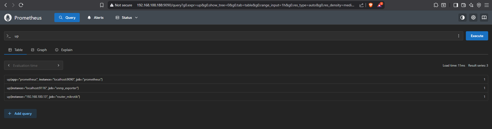
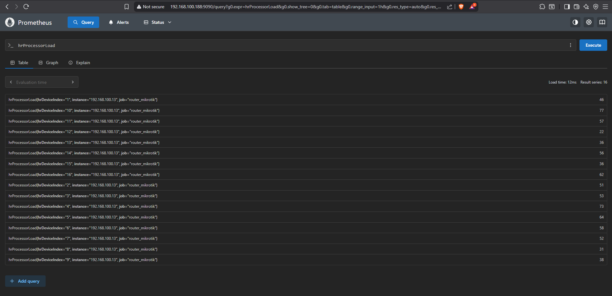

Artikel ini membahas cara menginstall [Prometheus](https://github.com/prometheus/prometheus) dan penggunannya. Ini adalah lanjutan dari artikel [Prometheus SNMP Exporter](). Jadi tutorial dalam artikel ini dapat diikuti dengan asumsi SNMP Exporter sudah terinstall dan berjalan dengan benar.

## Pre-requisites
- **Pemahaman dasar** dalam menggunakan Linux  
- **Pemahaman dasar** mengenai *MIB* (Management Information Base) dan *SNMP* (Simple Network Management Protocol)
- **Prometheus SNMP Exporter** sudah terinstall dan berjalan dengan benar

## Instalasi Prometheus
```bash
# Download Prometheus
# Versi terbaru lihat di https://prometheus.io/download/
grafana@grafana-wahayu:~$ cd /tmp
grafana@grafana-wahayu:/tmp$ wget https://github.com/prometheus/prometheus/releases/download/v3.5.0/prometheus-3.5.0.linux-amd64.tar.gz
grafana@grafana-wahayu:/tmp$ tar -xvzf prometheus-3.5.0.linux-amd64.tar.gz
grafana@grafana-wahayu:/tmp$ cd prometheus-3.5.0.linux-amd64
grafana@grafana-wahayu:/tmp/prometheus-3.5.0.linux-amd64$ ls
LICENSE  NOTICE  prometheus  prometheus.yml  promtool

# Pindahkan file prometheus dan promtool ke /usr/local/bin
grafana@grafana-wahayu:/tmp/prometheus-3.5.0.linux-amd64$ sudo mv prometheus promtool /usr/local/bin

# Pindahkan config file prometheus.yml ke /etc/prometheus/
grafana@grafana-wahayu:/tmp/prometheus-3.5.0.linux-amd64$ sudo mv prometheus.yml /etc/prometheus

# Buat directory database Prometheus
grafana@grafana-wahayu:/tmp/prometheus-3.5.0.linux-amd64$ sudo mkdir /var/lib/prometheus

# Ganti ownership directory ke user prometheus
grafana@grafana-wahayu:/tmp/prometheus-3.5.0.linux-amd64$ sudo chown prometheus:prometheus /var/lib/prometheus/

# Buat file systemd untuk Prometheus
grafana@grafana-wahayu:/tmp/prometheus-3.5.0.linux-amd64$ sudo nano /etc/systemd/system/prometheus.service
```
```bash
# Isi prometheus.service dengan ini

[Unit]
Description=Prometheus Server
Documentation=https://prometheus.io/docs/introduction/overview/
After=network-online.target

[Service]
User=prometheus
Group=prometheus
Restart=on-failure
ExecStart=/usr/local/bin/prometheus \
  --config.file=/etc/prometheus/prometheus.yml \
  --storage.tsdb.path=/var/lib/prometheus/data \
  --storage.tsdb.retention.time=30d

[Install]
WantedBy=multi-user.target
```
```bash
# Reload daemon
grafana@grafana-wahayu:/tmp/prometheus-3.5.0.linux-amd64$ sudo systemctl daemon-reload

# Enable Prometheus
grafana@grafana-wahayu:/tmp/prometheus-3.5.0.linux-amd64$ sudo systemctl enable prometheus

# Jalankan Prometheus
grafana@grafana-wahayu:/tmp/prometheus-3.5.0.linux-amd64$ sudo systemctl start prometheus

# Cek status Prometheus
# Jika berhasil akan seperti ini

grafana@grafana-wahayu:/tmp/prometheus-3.5.0.linux-amd64$ sudo systemctl status prometheus
● prometheus.service - Prometheus Server
     Loaded: loaded (/etc/systemd/system/prometheus.service; enabled; preset: e>
     Active: active (running) since Mon 2025-08-18 16:53:13 WIB; 25min ago
       Docs: https://prometheus.io/docs/introduction/overview/
   Main PID: 7616 (prometheus)
      Tasks: 13 (limit: 9434)
     Memory: 43.4M (peak: 44.5M)
        CPU: 1.347s
     CGroup: /system.slice/prometheus.service
             └─7616 /usr/local/bin/prometheus --config.file=/etc/prometheus/pro...
```
```bash
# Edit file /etc/prometheus/prometheus.yml dan tambahkan baris ini di bagian bawah

  - job_name: 'router_mikrotik'
    static_configs:
      - targets:
        - 192.168.100.13
#        - 192.168.1.2  # SNMP device.
#        - switch.local # SNMP device.
#        - tcp://192.168.1.3:1161  # SNMP device using TCP transport and custom>
    metrics_path: /snmp
    params:
      auth: [public_v2]
      module: [mikrotik]
    relabel_configs:
      - source_labels: [__address__]
        target_label: __param_target
      - source_labels: [__param_target]
        target_label: instance
      - target_label: __address__
        replacement: 127.0.0.1:9116  # The SNMP exporter's real hostname:port.

  # Global exporter-level metrics
  - job_name: 'snmp_exporter'
    static_configs:
      - targets: ['localhost:9116']
```

```bash
# Restart Prometheus
grafana@grafana-wahayu:/tmp/prometheus-3.5.0.linux-amd64$ sudo systemctl restart prometheus
```
Instalasi dan konfigurasi Prometheus sudah selesai. Selanjutnya kita buka browser dan akses UI Prometheus melalui `IP_server:9090`. Kemudian eksekusi query "up" pada query box untuk memastikan apakah target kita sudah terdeteksi oleh Prometheus.
[](http-prometheus.png)

```
# 2 baris ini menunjukkan bahwa snmp_exporter dan Mikrotik CCR yang menjadi target kita sudah terbaca oleh Prometheus.

up{instance="localhost:9116", job="snmp_exporter"}  1
up{instance="192.168.100.13", job="router_mikrotik"}
```

Sekarang mari kita coba eksekusi query `hrProcessorLoad` untuk melihat penggunaan CPU pada Router Mikrotik yang menjadi target.
[](http-hrprocessorload.png)

Terdapat 16 item pada hasil query dengan nilai berbeda-beda pada bagian kanan. Ini karena Router tersebut menggunakan CPU dengan 16 core, dan MIB hrProcessorLoad menampilkan value dari masing-masing core. Jadi kita bisa menggunakan operator "avg" untuk menampilkan hasil rata-rata penggunaan CPU.

[")](http-avg_hrprocessorload.png)

## Penutup

Prometheus selesai kita install, dan sudah bisa menarik data SNMP target melalui SNMP Exporter. Pada artikel selanjutnya kita akan membahas tentang Grafana dan cara membuat panel grafik dari metric SNMP yang dikumpulkan oleh Prometheus.