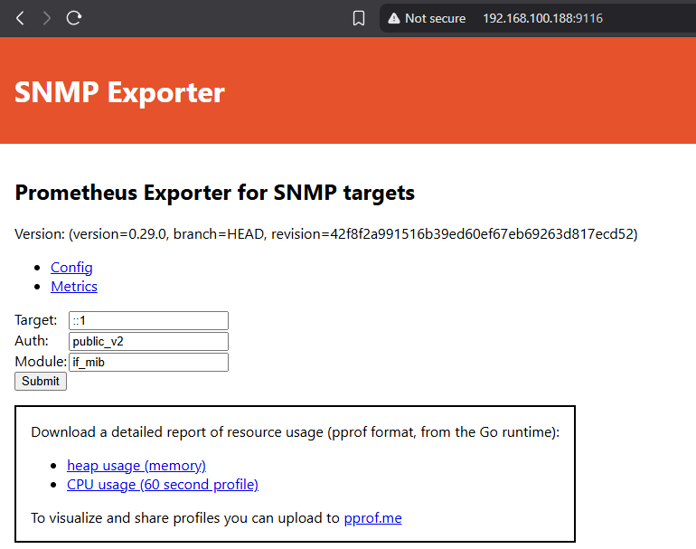

Artikel ini membahas tentang cara menginstall [SNMP Exporter](https://github.com/prometheus/snmp_exporter). Software ini digunakan untuk menarik data SNMP dan menerjemahkannya ke format yang dapat dibaca oleh Prometheus. Karena by-default Prometheus tidak dapat membaca data SNMP secara langsung.

## Pre-requisites

- **Pemahaman dasar** dalam menggunakan Linux  
- **Pemahaman dasar** mengenai *MIB* (Management Information Base) dan *SNMP* (Simple Network Management Protocol)  
- Untuk tutorial ini dan lanjutan tentang **Prometheus** dan **Grafana**, server yang digunakan adalah:  
  - Ubuntu `24.04.3 LTS (Minimal Version)`
- Pastikan waktu pada server sudah akurat dan *System clock synchronized: yes*.  
  - Cek menggunakan command:  
    ```bash
    timedatectl
    ```
- Tutorial ini dibuat dengan asumsi **SNMP pada Router/Switch dapat diakses dari server**.  
  - Cek menggunakan command:  
    ```bash
    snmpwalk -v2c -c community_name ip_target
    ```

## Instalasi SNMP Exporter
```bash

# Download snmp_exporter.
# Versi terbaru dapat dilihat di https://github.com/prometheus/snmp_exporter/releases
grafana@grafana-wahayu:~$ cd /tmp
grafana@grafana-wahayu:/tmp$ wget https://github.com/prometheus/snmp_exporter/releases/download/v0.29.0/snmp_exporter-0.29.0.linux-amd64.tar.gz

# Ekstrak dan pindahkan file snmp_exporter ke /usr/local/bin
grafana@grafana-wahayu:/tmp$ tar -xvf snmp_exporter-0.29.0.linux-amd64.tar.gz
grafana@grafana-wahayu:/tmp$ cd snmp_exporter-0.29.0.linux-amd64
grafana@grafana-wahayu:/tmp/snmp_exporter-0.29.0.linux-amd64$ ls
LICENSE  NOTICE  snmp.yml  snmp_exporter
grafana@grafana-wahayu:/tmp/snmp_exporter-0.29.0.linux-amd64$ sudo mv snmp_exporter /usr/local/bin

# Buat directory untuk file snmp.yml dan pindahkan file snmp.yml ke sana
grafana@grafana-wahayu:/tmp/snmp_exporter-0.29.0.linux-amd64$ sudo mkdir -p /etc/prometheus/snmp_exporter/
grafana@grafana-wahayu:/tmp/snmp_exporter-0.29.0.linux-amd64$ sudo mv snmp.yml /etc/prometheus/snmp_exporter/

# Buat file systemd untuk snmp_exporter
grafana@grafana-wahayu:/tmp/snmp_exporter-0.29.0.linux-amd64$ sudo nano /etc/systemd/system/snmp_exporter.service

```

```bash
# Isi file systemd snmp_exporter.service sebagai berikut kemudian save:

[Unit]
Description=SNMP Exporter
After=network-online.target

# This assumes you are running snmp_exporter under the user "grafana"

[Service]
User=grafana
Restart=on-failure
ExecStart=/usr/local/bin/snmp_exporter --config.file=/etc/prometheus/snmp_exporter/snmp.yml

[Install]
WantedBy=multi-user.target
```

```bash
# Jalankan systemd snmp_exporter.service yang sudah dibuat
grafana@grafana-wahayu:/tmp/snmp_exporter-0.29.0.linux-amd64$ sudo systemctl daemon-reload
grafana@grafana-wahayu:/tmp/snmp_exporter-0.29.0.linux-amd64$ sudo systemctl enable snmp_exporter
grafana@grafana-wahayu:/tmp/snmp_exporter-0.29.0.linux-amd64$ sudo systemctl start snmp_exporter

# Cek status systemd tersebut. Jika berhasil, maka outputnya akan seperti ini:
grafana@grafana-wahayu:/tmp/snmp_exporter-0.29.0.linux-amd64$ sudo systemctl status snmp_exporter

● snmp_exporter.service - SNMP Exporter
     Loaded: loaded (/etc/systemd/system/snmp_exporter.service; enabled; preset: enabled)
     Active: active (running) since Sun 2025-08-17 13:43:29 WIB; 2s ago
   Main PID: 2939 (snmp_exporter)
      Tasks: 10 (limit: 9434)
     Memory: 25.2M (peak: 26.4M)
        CPU: 204ms
     CGroup: /system.slice/snmp_exporter.service
             └─2939 /usr/local/bin/snmp_exporter --config.file=/etc/prometheus/snmp_exporter/snmp.yml
```
Kemudian akses UI SNMP Exporter melalui browser melalui ```IP_server:9116```. IP server pada tutorial ini adalah ```192.168.100.188```.
[](ui_snmp_exporter.png)

## Instalasi SNMP Exporter Config Generator

Config file SNMP Exporter adalah ```snmp.yml``` yang ada di ```/etc/prometheus/snmp_exporter/```. Ini adalah config file bawaan yang ada di dalam file snmp_exporter.tar.gz yang di-download sebelumnya. File ini sudah memuat module yang umum digunakan untuk memonitor perangkat seperti Router, Switch, Server, atau UPS. Akan tetapi untuk penggunaan yang lebih spesifik, kita bisa membuat file config snmp.yml sendiri menggunakan generator yang disediakan. Sehingga snmp.yml yang kita gunakan menjadi lebih "rapi" dan hanya menarik data SNMP yang kita butuhkan saja.

```bash
# Install packages yang dibutuhkan
grafana@grafana-wahayu:~$ sudo apt-get install unzip build-essential libsnmp-dev

# Install git
grafana@grafana-wahayu:~$ sudo apt install git -y

# Download dan install Go
grafana@grafana-wahayu:~$ wget https://go.dev/dl/go1.25.0.linux-amd64.tar.gz
grafana@grafana-wahayu:~$ sudo tar -C /usr/local -xzf go1.25.0.linux-amd64.tar.gz

# Tambahkan baris
# export PATH=$PATH:/usr/local/go/bin
# ke
# $HOME/.profile
grafana@grafana-wahayu:~$ source $HOME/.profile

# Pastikan Go sudah terinstall dengan command
# go version
grafana@grafana-wahayu:~$ go version
go version go1.25.0 linux/amd64

# Clone snmp_exporter.git dan build generator
grafana@grafana-wahayu:~$ git clone https://github.com/prometheus/snmp_exporter.git
grafana@grafana-wahayu:~$ cd snmp_exporter/generator/
grafana@grafana-wahayu:~/snmp_exporter/generator$ make generator mibs
```

Selanjutnya kita akan membuat file ```snmp.yml``` baru menggunakan generator. Sebagai contoh, kita akan membuat module untuk memonitor penggunaan CPU, temperatur, status PSU, uptime, dan penggunaan RAM pada perangkat Router Mikrotik CCR 2116.

### Mencari MIB (Management Information Base) yang Dibutuhkan

Kita bisa menggunakan software [MIB Browser](https://ireasoning.com/download.shtml) untuk untuk mengeksplorasi MIB apa saja yang bisa kita dapatkan dari perangkat target. Informasi MIB yang digunakan oleh masing-masing vendor perangkat bisa ditemukan di internet. Misalnya untuk Mikrotik CCR bisa menggunakan SNMPv2-SMI, dan spesifiknya bisa menggunakan MIKROTIK-MIB.

[](mib_browser.png)

Selanjutnya kita akan membuat file generator untuk meng-"generate" file ```snmp.yml```:

```bash

```
