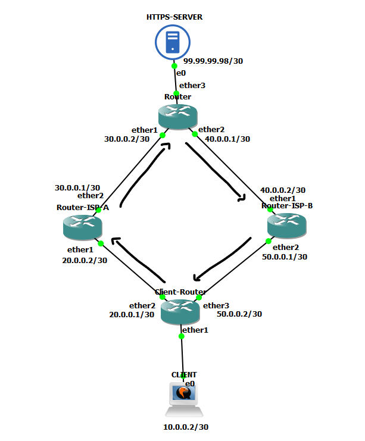
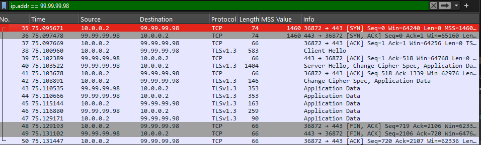
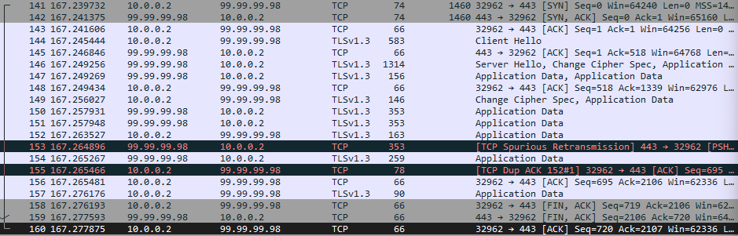
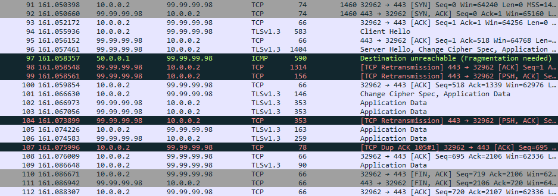
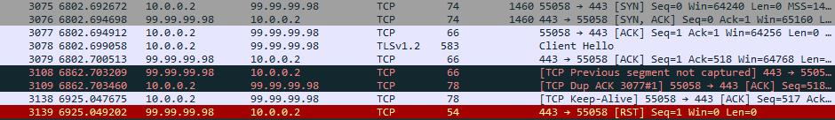
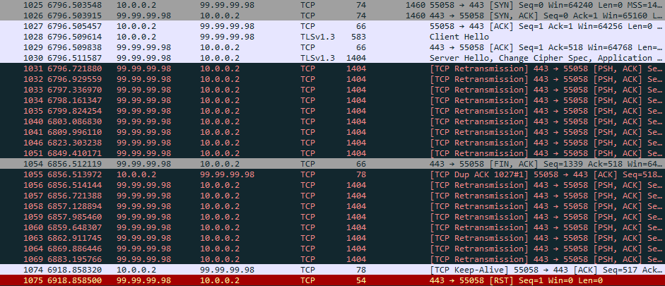

Pernah mengalami kendala jaringan di mana koneksi client ke HTTPS server "nyangkut" secara random, padahal HTTP normal, firewall blocking tidak ada, port checking juga aman? Bisa jadi masalahnya ada pada MTU.

Beberapa waktu lalu saya dihadapkan dengan isu jaringan yang belum pernah saya temui sebelumnya. Di mana curl dari client ke server menggunakan HTTP aman, akan tetapi curl menggunakan HTTPS malah nyangkut lumayan lama sampai connection reset. Analisa saya, jika HTTP saja bisa, artinya tidak ada masalah pada layer 3 dong antara client dan server. Check port 80 dan 443 dari client ke server pun statusnya juga open, jadi layer 4 pun seharusnya juga aman kan? Akan tetapi ICMP server mati sehingga server tidak bisa di-probe. Selanjutnya saya coba curl HTTPS ke server menggunakan jaringan lain, ternyata bisa. Artinya masalah ini hanya terjadi di jaringan yang saya gunakan, bukan faktor server atau perangkat client.

Setelah mencari-cari jawaban di internet, saya menemukan solusi untuk menurunkan MTU pada perangkat client. Setelah menurunkan MTU dari 1500 (default) ke 1400 pada perangkat client, curl HTTPS ke server pun langsung bisa. Permasalahan teratasi, namun rasa penasaran saya makin menjadi-jadi.

Setelah menganalisa lebih lanjut, Alhamdulillah akhirnya saya berhasil memahami teknis permasalahan yang terjadi tersebut.

>- TL;DR: Masalah ini terjadi karena ada perbedaan nilai MTU dari jalur yang dilewati trafik antara client-server. Lalu karena ICMP pada server mati sehingga PMTUD tidak berfungsi. Kemudian karena jalur trafik antar client-server asimetris.

Jaringan client memiliki beberapa koneksi BGP ke upstream yang berbeda-beda. Trafik dari client ke server melewati BGP A, akan tetapi kembali lewat BGP B. BGP B terhubung ke upstream menggunakan EoIP. MTU dari EoIP adalah 1458, karena 42 bytes dipakai untuk EoIP encapsulation. Jadi ketika client-server melakukan TCP handshake, maka MSS client yang diterima server adalah 1460 karena melewati BGP A, sedangkan MSS server yang diterima client adalah 1418 karena dipangkas oleh EoIP interface BGP B. Karena MSS client yang diterima server adalah 1460, maka server akan mengirim data dengan MSS 1460 juga. Padahal data dengan MSS 1460 tidak bisa melewati jalur BGP B yang MTU-nya hanya 1458. Lalu karena ICMP server dimatikan, Router BGP B pun tidak bisa memberi tahu server menggunakan PMTUD bahwa ukuran data yang dia kirim harus disesuaikan dengan MTU si Router, protocol yang memanfaatkan ICMP. Jadi ketika server mengirimkan data dengan MSS 1460, maka data ini akan di-drop oleh Router BGP B sehingga koneksinya akan "nyangkut". Makanya ketika MTU client diturunkan menjadi 1400, koneksi client-server kembali normal. Karena MSS client yang dikirim ke server juga akan lebih kecil.

Sebelum kita mereplikasi kasus tersebut menggunakan GNS3, mari kita jelaskan terlebih dahulu istilah MTU, MSS, PMTUD yang kita sebut di atas.

## Apa itu MTU (Maximum Transmission Unit) dan MSS (Maximum Segment Size)?

MTU adalah istilah untuk jumlah maksimum data dalam bentuk bytes yang bisa ditransmisikan dalam 1 packet, yang default-nya adalah 1500 bytes. Dalam 1 packet terdapat IP Header, TCP Header, dan payload. Jika data ini melebihi ukuran MTU, maka akan terjadi IP fragmentation apabila flag DF=0. Artinya data tersebut akan dibagi menjadi 2 atau lebih packet dengan masing-masing IP Header yang sama. Jika flag DF=1, artinya packet tersebut tidak boleh difragmentasi sehingga packet tersebut akan di drop dan pengirim akan menerima pesan ICMP Fragmentation needed. Lalu pengirim akan mengirim ulang packet tersebut dengan ukuran yang disesuaikan.

Di dalam packet terdapat IP Header, TCP Header, dan payload. Ukuran maksimum payload inilah yang disebut dengan MSS. Jadi packet dengan ukuran 1500 bytes akan terdiri dari 20 bytes IP Header + 20 bytes TCP Header + 1460 payload. MSS ini akan saling diinformasikan oleh client-server ketika melakukan TCP handshake. Makanya EoIP interface dengan MTU 1458 hanya bisa dilewati oleh packet dengan MSS 1418, karena 40 bytes nya adalah IP Header dan TCP Header.

## Apa itu PMTUD (Path MTU Discovery)?

PMTUD adalah mekanisme yang digunakan pengirim data (client atau server) untuk mengetahui nilai MTU terkecil pada masing-masing router atau perangkat layer 3 yang akan dilewatinya untuk mencapai tujuan. Tujuannya agar pengirim bisa menyesuaikan ukuran packet yang akan dikeluarkannya agar "muat" ketika melewati jalur ke tujuannya. Tujuan lainnya adalah agar tidak terjadi IP fragmentation. Perlu diketahui bahwa umumnya IP fragmentation tidak diizinkan (DF=1) karena IP fragmentation sangat membebani performa jaringan. PMTUD memanfaatkan ICMP. Jadi jika ICMP dimatikan, maka PMTUD juga ikut mati.

> 
Client mengirim packet ke Server melewati Router A,B,C dengan ukuran 1500 bytes, dan flag DF=1. Router C memiliki MTU 1400. Ketika packet sampai ke Router C, Router C akan men-drop packet tersebut dan mengirim pesan ICMP "Fragmentation Needed" ke client yang memuat informasi MTU pada Router tersebut. Client menerima pesan ICMP tersebut dan mengirim ulang packet dengan menyesuaikan ukurannya dengan MTU Router C.

Apabila Client mengirim packet sebesar 1500 bytes dengan DF=0, lalu packet melewati Router C. Maka Router C akan memfragmentasi packet tersebut tanpa memberitahu pengirim.


## Simulasi GNS3

>- Topologi didesain agar trafik antara Client dan Server selalu melalui jalur yang berbeda (asimetris)
>- Client dan server menggunakan cloud-ubuntu-24.04
>- IP client 10.0.0.2, IP server 99.99.99.98
>- Server dibuat menjadi HTTPS server untuk mensimulasikan curl dari client
>- Router menggunakan Mikrotik CHR 7.19.4
>- Fokus dari pembahasan ini adalah behavior dari MTU. Jadi untuk konfigurasi setupnya tidak dibahas di sini.
>- Trafik pada interface client dan server akan dimonitor menggunakan wireshark

> 



### Simulasi 1. Keadaan Normal

Pada simulasi pertama kita akan mencoba melakukan curl ke HTTPS server dari client. Kemudian kita akan memantau melalui wireshark apa saja yang terjadi ketika kita melakukan curl.

> 
```bash
ubuntu@Client:~$ curl -Iv https://99.99.99.98 --insecure
*   Trying 99.99.99.98:443...
* Connected to 99.99.99.98 (99.99.99.98) port 443
* ALPN: curl offers h2,http/1.1
* TLSv1.3 (OUT), TLS handshake, Client hello (1):
* TLSv1.3 (IN), TLS handshake, Server hello (2):
* TLSv1.3 (IN), TLS handshake, Encrypted Extensions (8):
* TLSv1.3 (IN), TLS handshake, Certificate (11):
* TLSv1.3 (IN), TLS handshake, CERT verify (15):
* TLSv1.3 (IN), TLS handshake, Finished (20):
* TLSv1.3 (OUT), TLS change cipher, Change cipher spec (1):
* TLSv1.3 (OUT), TLS handshake, Finished (20):
* SSL connection using TLSv1.3 / TLS_AES_256_GCM_SHA384 / X25519 / RSASSA-PSS
* ALPN: server accepted http/1.1
* Server certificate:
*  subject: C=ID
*  start date: Aug  2 04:54:26 2025 GMT
*  expire date: Aug  2 04:54:26 2026 GMT
*  issuer: C=ID
*  SSL certificate verify result: self-signed certificate (18), continuing anyway.
*   Certificate level 0: Public key type RSA (2048/112 Bits/secBits), signed using sha256WithRSAEncryption
* using HTTP/1.x
> HEAD / HTTP/1.1
> Host: 99.99.99.98
> User-Agent: curl/8.5.0
> Accept: */*
>
* TLSv1.3 (IN), TLS handshake, Newsession Ticket (4):
* TLSv1.3 (IN), TLS handshake, Newsession Ticket (4):
* old SSL session ID is stale, removing
< HTTP/1.1 200 OK
HTTP/1.1 200 OK
< Server: nginx/1.24.0 (Ubuntu)
Server: nginx/1.24.0 (Ubuntu)
< Date: Sun, 03 Aug 2025 10:18:33 GMT
Date: Sun, 03 Aug 2025 10:18:33 GMT
< Content-Type: application/octet-stream
Content-Type: application/octet-stream
< Content-Length: 25
Content-Length: 25
< Connection: keep-alive
Connection: keep-alive

<
* Connection #0 to host 99.99.99.98 left intact
ubuntu@Client:~$

```


Di atas terlihat bahwa curl ke HTTPS hasilnya normal.

> 


> 



Pada Gambar 2 dan 3, terlihat MSS=1460 dari client maupun dari server ketika melakukan TCP handshake.

Artinya MTU pada kondisi ini sama, yaitu 1500 bytes. Kemudian perhatikan item nomor 40 pada Gambar 2. Packet sebesar 1404 bytes dikirimkan oleh HTTPS server ke client. 1404 bytes lebih kecil dari 1500 bytes, sehingga tidak ada kendala pada kondisi ini.

### Simulasi 2. MTU diperkecil pada Router-ISP-B

Pada simulasi ini, MTU pada Router yang dilewati oleh HTTPS server ke client akan kita set menjadi 1300. Lalu kita coba curl lagi dari sisi client.

> 
```bash
ubuntu@Client:~$ curl -Iv https://99.99.99.98 --insecure
*   Trying 99.99.99.98:443...
* Connected to 99.99.99.98 (99.99.99.98) port 443
* ALPN: curl offers h2,http/1.1
* TLSv1.3 (OUT), TLS handshake, Client hello (1):
* TLSv1.3 (IN), TLS handshake, Server hello (2):
* TLSv1.3 (IN), TLS handshake, Encrypted Extensions (8):
* TLSv1.3 (IN), TLS handshake, Certificate (11):
* TLSv1.3 (IN), TLS handshake, CERT verify (15):
* TLSv1.3 (IN), TLS handshake, Finished (20):
* TLSv1.3 (OUT), TLS change cipher, Change cipher spec (1):
* TLSv1.3 (OUT), TLS handshake, Finished (20):
* SSL connection using TLSv1.3 / TLS_AES_256_GCM_SHA384 / X25519 / RSASSA-PSS
* ALPN: server accepted http/1.1
* Server certificate:
*  subject: C=ID
*  start date: Aug  2 04:54:26 2025 GMT
*  expire date: Aug  2 04:54:26 2026 GMT
*  issuer: C=ID
*  SSL certificate verify result: self-signed certificate (18), continuing anyway.
*   Certificate level 0: Public key type RSA (2048/112 Bits/secBits), signed using sha256WithRSAEncryption
* using HTTP/1.x
> HEAD / HTTP/1.1
> Host: 99.99.99.98
> User-Agent: curl/8.5.0
> Accept: */*
>
* TLSv1.3 (IN), TLS handshake, Newsession Ticket (4):
* TLSv1.3 (IN), TLS handshake, Newsession Ticket (4):
* old SSL session ID is stale, removing
< HTTP/1.1 200 OK
HTTP/1.1 200 OK
< Server: nginx/1.24.0 (Ubuntu)
Server: nginx/1.24.0 (Ubuntu)
< Date: Sun, 03 Aug 2025 10:51:35 GMT
Date: Sun, 03 Aug 2025 10:51:35 GMT
< Content-Type: application/octet-stream
Content-Type: application/octet-stream
< Content-Length: 25
Content-Length: 25
< Connection: keep-alive
Connection: keep-alive

<
* Connection #0 to host 99.99.99.98 left intact
```


Terlihat curl ke HTTPS server masih normal. Tapi proses apa yang berubah ketika MTU pada Router yang dilewati packet diset lebih kecil?

> 


> 



Perhatikan item no 142 pada Gambar 3. Wireshark Client. MSS server yang diterima oleh client masih 1460, padahal Router yang dilewati packet dari server sudah diset ke 1300. Kemungkinan di sini PMTUD belum terjadi. Tapi perhatikan item no 97-99 pada Gambar 4. Wireshark Server. Item 97 menunjukkan bahwa Router dengan IP 50.0.0.1 (Router-ISP-B) mengirim pesan ICMP "Fragmentation Needed" ke IP 99.99.99.98 (HTTPS server). Di sinilah PMTUD terjadi. Ini karena pada item no 96 server mengirim data sebesar 1404 melewati Router-ISP-B, padahal interface pada Router tersebut MTU-nya hanya 1300. Kemudian pada item no 98-99, server mentransmit ulang packet TCP masing-masing sebesar 1314 dan 156 bytes. 1314 lebih besar 14 bytes dibanding 1300, namun hal ini normal (overhead).

Kesimpulannya, koneksi antar client dan server masih bisa berjalan lancar karena PMTUD.

### Simulasi 3. ICMP HTTPS Server Dimatikan

Pada simulasi ini kita akan mematikan ICMP pada Router HTTPS server sehingga PMTUD tidak dapat berfungsi. Lalu dengan MTU yang masih 1300 di Router-ISP-B, kita akan melakukan curl dari client ke server.

> 
```bash
ubuntu@Client:~$ curl -Iv https://99.99.99.98 --insecure
*   Trying 99.99.99.98:443...
* Connected to 99.99.99.98 (99.99.99.98) port 443
* ALPN: curl offers h2,http/1.1
* TLSv1.3 (OUT), TLS handshake, Client hello (1):
* Recv failure: Connection reset by peer
* OpenSSL SSL_connect: Connection reset by peer in connection to 99.99.99.98:443
* Closing connection
curl: (35) Recv failure: Connection reset by peer
ubuntu@Client:~$
```


Terlihat curl gagal dilakukan dan nyangkut ketika melakukan TLS 1.3 Handshake.

> 


> 



Perhatikan item nomor 3108 dan 3109 pada Gambar 5. Wireshark Client di atas. Client menunggu data yang tak kunjung datang dari server selama 60 detik sebelum akhirnya koneksi direset oleh server. Sekarang perhatikan item 1031-1075 pada Gambar 6. Wireshark Server. Server berulang kali mencoba mentransmit packet TCP yang sama sebesar 1404 bytes ke arah server. Ini karena server tidak mendapat respon ACK dari client sehingga packet tersebut terus ditransmit ulang sebelum akhirnya koneksi di-reset. Yang terjadi adalah packet tersebut di-drop oleh Router-ISP-B, dan Router tersebut juga sebenarnya sudah mengirimkan pesan ICMP ke server agar server menurunkan ukuran packet yang dia kirim. Akan tetapi karena ICMP server mati, maka server tidak bisa menerima informasi tersebut (PMTUD tidak bisa terjadi).

## Penutup

Dari sisi server mungkin ICMP dimatikan sebagai langkah keamanan. Akan tetapi daripada menutup ICMP secara keseluruhan, alangkah lebih baik jika protocol ICMP yang berkaitan dengan PMTUD tetap dinyalakan untuk menghindari masalah MTU.

Solusi terbaik dari sisi client yang bisa saya pikirkan adalah dengan mengganti EoIP menjadi GRE Tunnel. Karena MTU GRE Tunnel adalah 1476, sedangkan EoIP 1458. Lalu membuat rule TCP Clamping pada Router untuk menyamakan nilai MTU baik untuk trafik yang keluar maupun yang masuk.